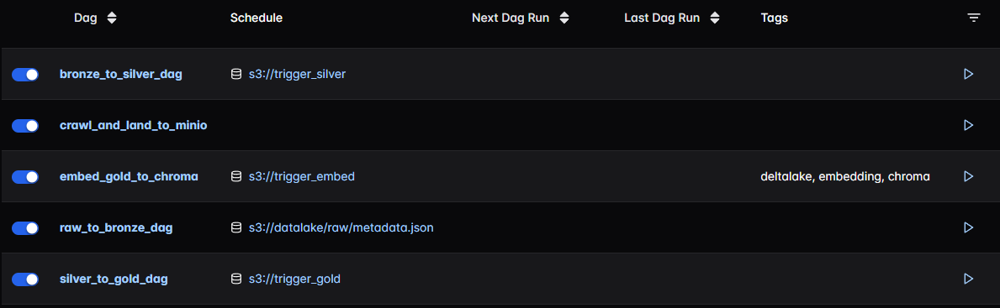
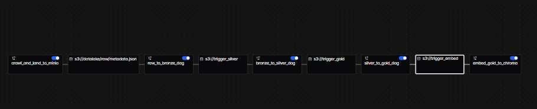

# Architecture
Building Incremental Batch Processing Data Pipeline with Medallion Architecture using MinIO (as the data lake), DuckDB, Delta Lake, (as Transformation Layer, also Apache Spark/Hive can be used in case of very Large Datasets) and Apache Airflow (as Orchestration Layer) for GenAI Application. 

#### Background:
A Crawler based pipeline for url means that data of the given URL can change or even new urls can get added. So, to build Knowledge base for AI Application, requires updated data. **As the length of texts of the crawled data of a url is not predictable as the data of url changes i.e on data updates in the websites may increase or decrease the number of text chunks of the url, so straight forward UPSERT is not an option, as this can lead to corrupt information for a given url**. So, atleast in the Gold Layer, we have to ensure that the old text chunks of a given url are deleted and freshly inserted to avoid mixed information as knowledge base for the GenAI Applications.

The High Level Architecture is shown below. The **Red Number** shows the flow of Data Pipeline:

 Here's how the pipeline works, step by step: 

1. **Crawling & Raw Layer**
   An Airflow DAG is triggered to crawl data from the BBC website. It saves:
   * **HTML files** under raw/html/
   * **Text files** under raw/text/

   * A **metadata.json** file under raw/ that contains the list of scraped URLs. (For Production, it's better to use a table instead of this json file)

2. **Raw to Bronze Layer** 
   The creation of metadata.json automatically triggers another DAG, **raw_to_bronze**, which:

   * Loads data from the raw layer into the bronze/ layer as Delta tables by chunking the text files saved in raw/texts
   * Performs **Append-Only ingestion**, meaning only newly discovered URLs (not already present in metadata.json) are processed — implementing **SCD Type 2**

3. **Bronze to Silver**
   Once the **raw_to_bronze** DAG completes, it triggers the **bronze_to_silver** DAG, which:

   * Deduplicates records by deleting outdated versions of updated URLs
   * Inserts new records with the updated text chunks

4. **Silver to Gold**
   Upon completion of the **bronze_to_silver** DAG, the **silver_to_gold** DAG is triggered. This stage:

   * Deduplicates and refreshes records for changed URLs by deleting the data of updated urls and freshly inserting the updated chunks.
   * Transforms and enriches the data by selecting relevant columns (text, metadata, id) for downstream embedding (e.g., for ChromaDB) using DuckDB and Delta

5. **Gold to Embedding (ChromaDB)**
   The final DAG, **gold_to_embed**, is triggered, which:

   * Deletes existing embeddings and chunks related to updated URLs from ChromaDB
   * Recomputes embeddings for new chunks and inserts them into ChromaDB

6. **RAG API Endpoint**
   A FastAPI endpoint is exposed, enabling retrieval of relevant chunks from **ChromaDB**. These chunks serve as context for a **Gemma 1B** model (served via llama-cpp-server), which:

   * Generates an answer based on the context
   * Returns the final response to the client via HTTP

This architecture ensures efficient, incremental data processing and up-to-date embeddings to power retrieval-augmented generation (RAG). This is a small POC, for very large data processing, we leverage **Apache Spark** with Metastore like **Hive** instead of **DuckDB** by using **SparkSubmitOperator** to submit spark-jobs for transformation, **CeleryExecutor** if powerful CPU or **KubernetesExecutor** for kubernetes in **Airflow** instead of **Local/SequentialExecutor** which is powerful for larger datasets.
#
### Summary of SCD in each layer:
1. **Raw Layer**: Store html, texts, metadata.json file
2. **Bronze Layer**: Append only mode/No Deletion (SCD Type 2)
3. **Silver/Gold/VectorDB**: Delete the records of updated urls and freshly insert the updated text chunks and embedding. (SCD Type 1)
#

# Note
This project is created to run on small compute. For more reliable execution of dags, we can use CeleryExecutor and use compose ready for production as defined in: https://airflow.apache.org/docs/apache-airflow/stable/howto/docker-compose/index.html , for larger dataset, use Apache Spark/Hive for transforming datasets.


# Steps to Run the Project
It's best to download and mount models (Embedding Model, LLM Model) to the containers.
```bash
# Step1: Download Embedding Model
mkdir -p local_model
cd local_model

wget https://huggingface.co/sentence-transformers/all-MiniLM-L6-v2/resolve/main/config.json
wget https://huggingface.co/sentence-transformers/all-MiniLM-L6-v2/resolve/main/pytorch_model.bin
wget https://huggingface.co/sentence-transformers/all-MiniLM-L6-v2/resolve/main/special_tokens_map.json
wget https://huggingface.co/sentence-transformers/all-MiniLM-L6-v2/resolve/main/tokenizer.json
wget https://huggingface.co/sentence-transformers/all-MiniLM-L6-v2/resolve/main/tokenizer_config.json
wget https://huggingface.co/sentence-transformers/all-MiniLM-L6-v2/resolve/main/vocab.txt

# Go back to Project Directory
cd ..
```

```bash
# Step2: Download LLM Model
mkdir -p ./llama_models/gemma3b
cd ./llama_models/gemma3b
```

```bash
# Step2: Replace the HF_TOKEN with your huggingface token
HF_TOKEN=<your_hugging_face_token>

wget --header="Authorization: Bearer $HF_TOKEN" \
  https://huggingface.co/google/gemma-3-1b-it-qat-q4_0-gguf/resolve/main/gemma-3-1b-it-q4_0.gguf?download=true \
  -O gemma-3-1b.gguf
```

```bash
# Step3: Create .env file with the help of .env.example and then
docker compose up --build -d
```

```bash
# Step4: After all containers spin up along with minio, execute this command to create all necessary buckets in MinIO
make create-minio-bucket
```

#

# Dags and DAG Dependencies
### DAGs

There are 5 dags that works on each layer:
1. **crawl_and_land_to_minio**: Crawls data and creates html, texts, json in **s3://datalake/raw**
2. **raw_to_bronze**: Creates Text chunks from texts stored in  **s3://datalake/raw/texts** and then loads into ** Bronze Delta Table*  in **s3://datalake/bronze**
3. **bronze_to_silver_dag**: Loads from **Bronze Delta Table*  **s3://datalake/bronze** to **Silver Delta Table*  **s3://datalake/silver** by transforming, deduplicating using DuckDB.
4. **silver_to_gold_dag**: Loads from **Silver Delta Table*  **s3://datalake/silver** to **Gold Delta Table*  **s3://datalake/gold** by deduplicating and transforming into the format supported by ChromaDB using DuckDB SQL.
5. **embed_gold_to_chroma**: Loads from **Gold Delta Table*  **s3://datalake/gold** to **gold_collection* in **ChromaDB** by deduplicating and inserting by recalculating embedding for the updated texts.

### DAG Dependencies

There are lots of techniques to create DAG Dependencies like using Airflow's API to trigger another dags, ExternalTaskSensor, etc. (https://www.astronomer.io/docs/learn/cross-dag-dependencies), for simplicity, I've used Datasets with @task(outlets) and schedule based on the Dataset. 

To track the datalineage, AIRFLOW__OPENLINEAGE__TRANSPORT='{"type": "http", "url": "http://fastapi:8000", "endpoint": "api/v1/lineage"}' has been used in Airflow environment which sends POST request to the fastapi endpoint where all the json has been written to **src/openlineage_events.jsonl** which can be visualized in marquez.